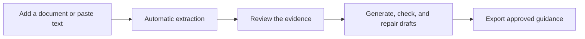

<h1 align="center">Operant</h1>
<p align="center"><strong>Turn the documents your team trusts into guidance your AI can follow.</strong></p>
<p align="center">
  <a href="#get-started">Get started</a> · <a href="#how-it-works">How it works</a> · <a href="docs/CAPABILITY_LEDGER.md">Capabilities</a> · <a href="CONTRIBUTING.md">Contributing</a>
</p>
<p align="center">
  <a href="https://github.com/Romone6/Operant/actions/workflows/ci.yml"></a>
  <a href="LICENSE"></a>
</p>

Operant turns the material you choose—handbooks, policies, playbooks, and other approved resources—into evidence-backed guidance. Add a resource and extraction begins automatically. Review the result, then use it to generate, check, repair, and export drafts.

## How it works



| Add what you know | Operant does the busywork | You stay in control |
| --- | --- | --- |
| Upload a PDF, DOCX, Markdown, text, CSV, JSON file, or paste text. | It extracts policies, terminology, scenarios, and possible conflicts. | Reviewers approve, edit, or reject the result before it is used or exported. |

## Get started

### You need

- Node.js 22 and pnpm 10
- Supabase for sign-in, data, and private file storage
- An OpenAI API key for live extraction and draft processing

```powershell
pnpm install --frozen-lockfile
Copy-Item .env.example .env.local
pnpm dev
```

Set these values in `.env.local`:

| Variable | Purpose |
| --- | --- |
| `NEXT_PUBLIC_SUPABASE_URL` | Supabase project URL |
| `NEXT_PUBLIC_SUPABASE_ANON_KEY` | Browser-safe Supabase key |
| `SUPABASE_SERVICE_ROLE_KEY` | Server-only data and storage access |
| `OPENAI_API_KEY` | Server-only extraction and draft processing |
| `OPERATORLAYER_EXPORT_SIGNING_KEY` | Optional export-manifest signing key |

Apply the migrations in [`supabase/migrations`](supabase/migrations) before using the app. With the Supabase CLI linked to your project, run `npx supabase db push`. Never expose the service-role or OpenAI key to the browser.

## Add your first resource

1. Create an organisation workspace.
2. Open **Sources** and add a file or paste text (up to 10 MiB).
3. Operant queues extraction as soon as the resource is added.
4. Review the policies, terminology, scenarios, and conflicts it found.
5. Approve a policy, then use the playground to generate, evaluate, repair, or export a draft.

Queued work is handled by the worker endpoint in a deployed environment. Local development can run the same job inline. Without `OPENAI_API_KEY`, Operant shows a configuration error instead of pretending to process the source.

## What you can export

After a reviewer approves a policy, Operant can create a versioned pack containing:

`company_voice.md`, `communication_policy.json`, `scenario_playbooks.json`, `phrase_library.json`, `forbidden_phrases.json`, `approval_rules.json`, `evaluation_rubric.json`, `approved_examples.jsonl`, `rejected_examples.jsonl`, `agent_prompt_pack.md`, and `policy_version_manifest.json`.

## Built to stay in control

- Only add material you are authorised to use.
- Sources are private and isolated by organisation; deleting one removes its derived records.
- Operant does not train a general model on your data by default.
- It does not connect to Gmail, Slack, or a CRM, and it does not send messages. It works on drafts and exports.

## Verify a change

```powershell
pnpm lint
pnpm test
pnpm test:integration
pnpm build
pnpm test:release-gate
```

Local checks cannot prove live Supabase permissions, private storage, or OpenAI processing. Run the [staging acceptance](docs/DEPLOYMENT.md) before a production deployment or release.

## Contribute and get help

- Read [CONTRIBUTING.md](CONTRIBUTING.md) before opening a change.
- Use [SECURITY.md](SECURITY.md) for private vulnerability reports.
- See the [capability ledger](docs/CAPABILITY_LEDGER.md) for the complete implementation record.

Operant is released under the [MIT License](LICENSE).
