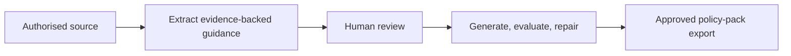

<p align="center">
  <a href="https://github.com/Romone6/Operant"><strong>Operant</strong></a>
</p>
<p align="center">
  <strong>Open-source communication governance for AI-assisted work.</strong>
</p>
<p align="center">
  <a href="#quick-start">Quick start</a> · <a href="docs/CAPABILITY_LEDGER.md">Capabilities</a> · <a href="CONTRIBUTING.md">Contributing</a> · <a href="SECURITY.md">Security</a>
</p>
<p align="center">
  <a href="https://github.com/Romone6/Operant/actions/workflows/ci.yml"></a>
  <a href="LICENSE"></a>
</p>

Operant turns authorised company material into evidence-backed policies, terminology, and scenarios that people review before using them to generate, evaluate, repair, and export drafts.

It is not an autonomous agent. The public core has no live connectors and never sends customer messages.

## How it works



| Included | Deliberately excluded |
| --- | --- |
| Organisation-scoped workspaces, uploads, source extraction, review queues, draft evaluation/repair, and versioned exports | Gmail/Slack/CRM sync, delivery, auto-send, billing, SSO, SCIM, webhooks, MCP, and per-organisation model keys |

## Quick start

### Prerequisites

- Node.js 22
- pnpm 10
- A Supabase project for authenticated persistence and private source storage
- An OpenAI API key for live model-based processing

```powershell
pnpm install --frozen-lockfile
Copy-Item .env.example .env.local
pnpm dev
```

Set these values in `.env.local`:

| Variable | Purpose |
| --- | --- |
| `NEXT_PUBLIC_SUPABASE_URL` | Supabase project URL |
| `NEXT_PUBLIC_SUPABASE_ANON_KEY` | Browser-safe Supabase anonymous key |
| `SUPABASE_SERVICE_ROLE_KEY` | Server-only persistence and storage operations |
| `OPENAI_API_KEY` | Server-only live extraction and draft processing |
| `OPERATORLAYER_EXPORT_SIGNING_KEY` | Optional HMAC key for export-manifest signatures |

Apply every SQL file in [`supabase/migrations`](supabase/migrations) to the target Supabase project before using the app. With the Supabase CLI linked to that project, run `npx supabase db push`. Never expose the service-role or OpenAI key to the browser.

Without `OPENAI_API_KEY`, live processing fails clearly. Operant does not invent extracted rules or successful processing states.

## Core workflow

1. Create an organisation-scoped workspace.
2. Paste authorised text or upload a supported file (maximum 10 MiB).
3. Process the source to derive policies, terminology, scenarios, and conflicts with evidence.
4. Review extracted records; approve at least one policy.
5. Use the playground to generate, evaluate, and repair a draft.
6. Export a versioned policy pack.

## Export contract

Exports are blocked until a human approves a policy. A pack contains only real records from that organisation:

- `company_voice.md`
- `communication_policy.json`
- `scenario_playbooks.json`
- `phrase_library.json`
- `forbidden_phrases.json`
- `approval_rules.json`
- `evaluation_rubric.json`
- `approved_examples.jsonl`
- `rejected_examples.jsonl`
- `agent_prompt_pack.md`
- `policy_version_manifest.json`

The manifest records artifact checksums, a version, and the prior-export pointer. Read-only policy-pack endpoints expose the latest pack and structural differences between real versions. Controlled JSON feedback import is limited to 100 validated records per request and is role-protected.

## Verification

```powershell
pnpm lint
pnpm test
pnpm test:integration
pnpm build
pnpm test:release-gate
```

`pnpm test` covers the unit contract; `pnpm test:integration` covers the supported API workflow. The release gate also scans for obvious credential material. See [deployment verification](docs/DEPLOYMENT.md) for the real Supabase/OpenAI staging acceptance test that local deterministic fixtures cannot replace.

## Data, safety, and privacy

- Ingest only material you are authorised to use.
- Source storage uses private object paths; deleting a source removes its derived records.
- Data is isolated by organisation and protected by Supabase RLS in the shipped migrations.
- The project does not train a general model on customer data by default.
- The MVP drafts, evaluates, repairs, and exports. It has no transport or auto-send capability.

## Project status

The public core is intentionally narrow. Current capability and non-goals live in the [capability ledger](docs/CAPABILITY_LEDGER.md). The staging acceptance test in [deployment documentation](docs/DEPLOYMENT.md) must pass before any production use or release claim.

## Contributing and security

- Read [CONTRIBUTING.md](CONTRIBUTING.md) before opening a change.
- Follow [SECURITY.md](SECURITY.md) for private vulnerability reporting.
- Follow [CODE_OF_CONDUCT.md](CODE_OF_CONDUCT.md) in all project spaces.
- Maintainers use [RELEASING.md](docs/RELEASING.md) and [CHANGELOG.md](CHANGELOG.md) for releases.

## Licence

Operant is released under the [MIT License](LICENSE).
